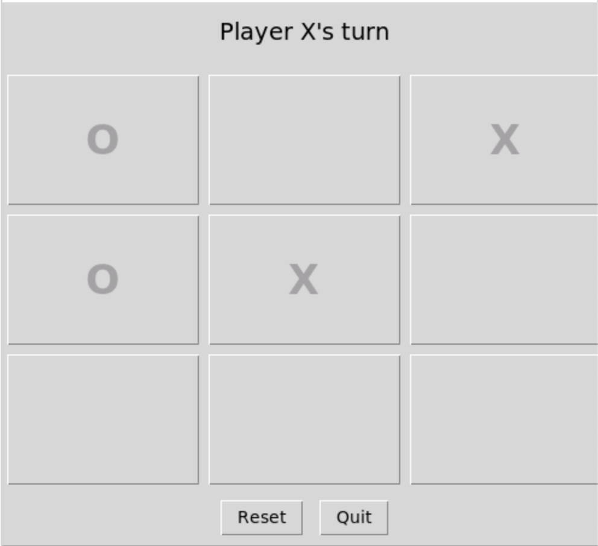

# Tic Tac Toe (Python + Tkinter)

A simple **Tic Tac Toe game** built with Python and Tkinter.  

---

## Preview
<p align="center">

</p>

---

## Features
- Two-player mode (X and O take turns).
- Win and draw detection.
- Reset button to restart the game.
- Minimal and responsive UI using Tkinter.

---

## Installation & Setup

1. **Clone the repository**
   ```bash
   git clone https://github.com/arijeetpandey/Tic-Tac-Toe
   cd Tic-Tac-Toe
   
2. Create a virtual environment (optional but recommended)
   ```bash
   python3 -m venv venv
   source venv/bin/activate   # On Linux/Mac
   venv\Scripts\activate
   
3. Run & play!
   ```bash
   python main.py

## License
This project is open source under the [MIT LICENSE](./LICENSE)
